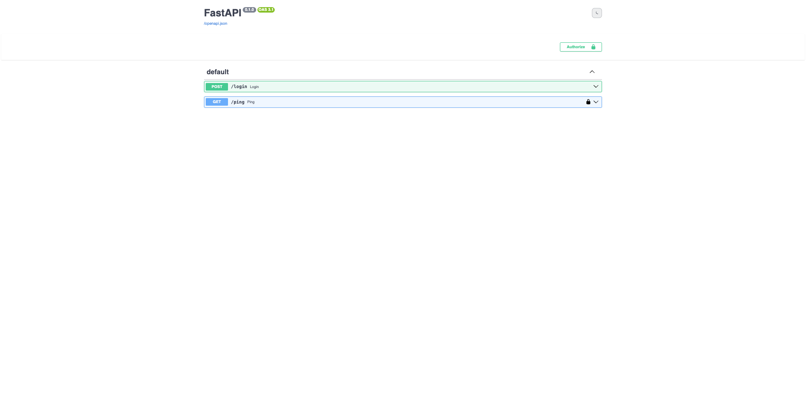
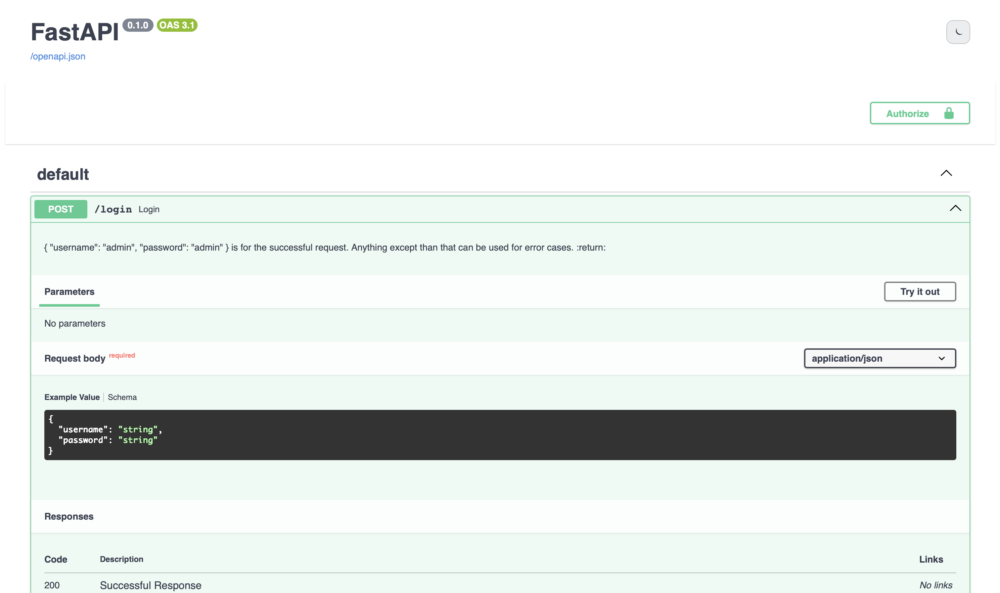
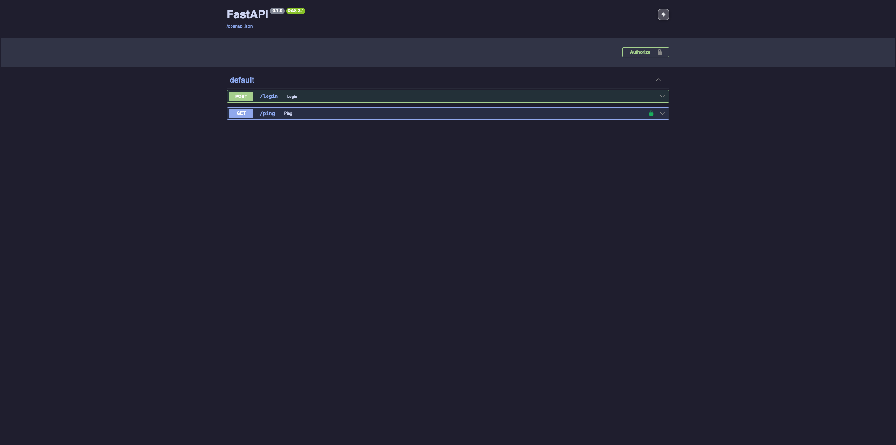
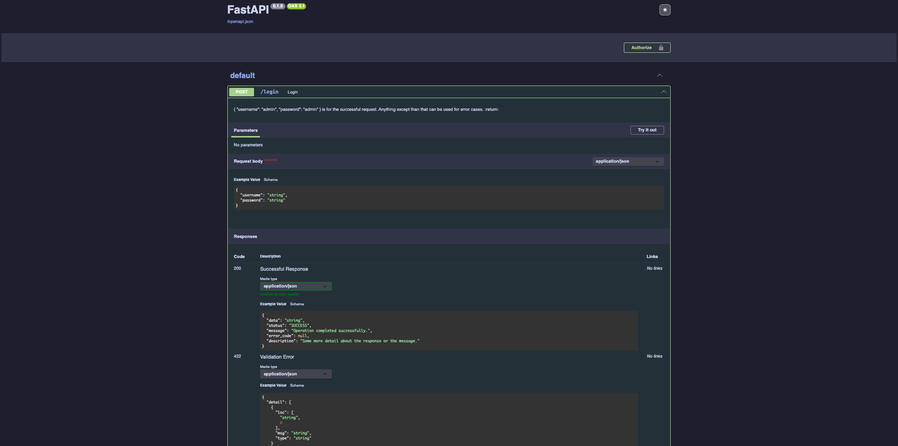

# fastapi-swagger-ui-theme

This package enhances the default Swagger UI by adding a persistent light/dark mode toggle, and better contrast.

---


---

## Features

- 🌗 Dark / Light theme toggle (persisted via `localStorage`)
- ⚡ Zero JavaScript configuration required
- 🔌 Plug-and-play setup with a single function call
- 📦 Packaged static assets (no CDN hacks, no manual mounting)

---
## Installation

Using **pip**:

```bash
pip install fastapi-swagger-ui-theme
```

Using **uv**:

```bash
uv add fastapi-swagger-ui-theme
```

---

## Usage

Add the light/dark toggle to your FastAPI application by importing and calling the provided function:

```python
from fastapi import FastAPI
from fastapi_swagger_ui_theme import setup_swagger_ui_theme

app = FastAPI(docs_url=None)  # Close the docs_url here.

setup_swagger_ui_theme(app, docs_path="/docs")
```

This will automatically inject the dark/light toggle and improved styles into the Swagger UI at `/docs`.

---

## Configuration

The `setup_swagger_ui_theme` function supports optional parameters to customize the behavior:

```python
from fastapi import FastAPI
from fastapi_swagger_ui_theme import setup_swagger_ui_theme

app = FastAPI(docs_url=None)  # Close the docs_url here.

setup_swagger_ui_theme(
    app,
    docs_path="/docs",
    title="API Docs",
    static_mount_path="/swagger-ui-theme-static",
    swagger_favicon_url=None,
    oauth2_redirect_url=None,
    init_oauth=None,
    swagger_ui_parameters=None,
)
```

- `docs_path`: URL path for Swagger UI (default: `/docs`)
- `title`: Title of the Swagger UI page (default: `"Swagger UI"`)
- `static_mount_path`: Path to mount the static assets (default: `/static/swagger-ui-theme`)
- `swagger_js_url`: URL to the Swagger UI JavaScript bundle (default: `https://unpkg.com/swagger-ui-dist@5/swagger-ui-bundle.js`, uses bundled version)
- `swagger_css_url`: URL to the Swagger UI CSS bundle (default: `https://unpkg.com/swagger-ui-dist@5/swagger-ui.css`, uses bundled version)
- `swagger_favicon_url`: URL to the favicon for Swagger UI (default: `None`, uses bundled version)
- `oauth2_redirect_url`: OAuth2 redirect URL for Swagger UI (default: `None`)
- `init_oauth`: Dict of OAuth2 initialization parameters (default: `None`)
- `swagger_ui_parameters`: Dict of additional Swagger UI parameters (default: `None`)
---

## Screenshots




---

## Running the Demo / Test Application

To run the demo/test application, follow these steps:

1. Clone the repository:
   ```bash
   git clone https://github.com/akutayural/fastapi-swagger-ui-theme.git
   cd fastapi-swagger-ui-theme
   ```

2. Initialize the environment with `uv`:
   ```bash
   uv init
   ```

3. Install the required dependencies:
   ```bash
   uv add uvicorn apiexception
   ```

4. Run the demo application:
   ```bash
   .venv/bin/uvicorn test.app:app --reload
   ```

---

## Credits

This project is inspired by and builds upon the official Swagger UI and FastAPI projects.

Special thanks to the following projects and their authors for their contributions to the dark theme lineage:

- [NRWLDev/fastapi-swagger-dark](https://github.com/NRWLDev/fastapi-swagger-dark) by NRWLDev, which further developed the dark theme integration.
- [georgekhananaev/darktheme-auth-fastapi-server](https://github.com/georgekhananaev/darktheme-auth-fastapi-server) by George Khanaev, which provided the original dark theme stylesheet.


Thanks to all contributors and maintainers of these projects.

